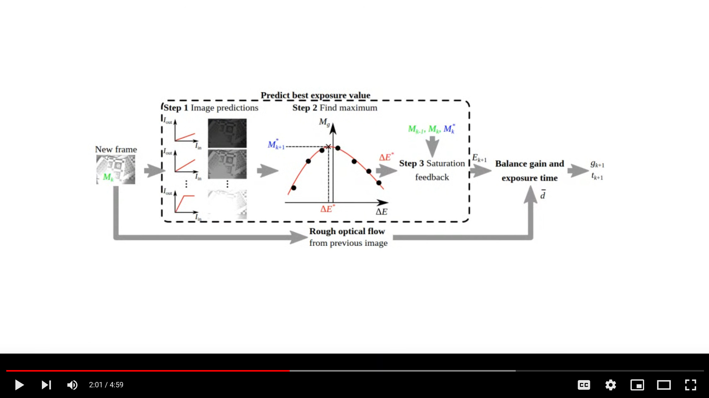

# vo-autoexpose

**Author:** Marc-André Bégin

<!-- The [Changelog](https://github.com/UZ-SLAMLab/ORB_SLAM3/blob/master/Changelog.md) describes the features of each version. -->

This repository contains the source code of an auto-exposure algorithm for maxing out VO performance in challenging light conditions. A ROS wrapper is also provided for the algorithm and the whole repository is structured as a ROS package. The core algorithm library is however independant of ROS and can be reused directly.

This software reuses some of the code from [aer_auto_exposure_gradient](https://github.com/ishaanmht/aer_auto_exposure_gradient) developped by [Ishaan Mehta, Tang Mingliang, and Timothy D. Barfoot](https://ieeexplore.ieee.org/document/9108676/). 

## Example recordings
In the orginial paper, the proposed algorithm is benchmarked against other exposure control methods. The ROS bag recordings of these experiments are available [here]().

## Supplementary video
A video showing the algorithm in action is available [here](https://www.youtube.com/watch?v=Guvhvb-uQpE) (or click the image below).

[](https://www.youtube.com/watch?v=Guvhvb-uQpE "Supplementary Video")


# 1. License

vo-autoexpose is released under [MIT license](https://github.com/MIT-Bilab/vo-autoexpose/blob/main/LICENSE). 

If you use this code in an academic work, please cite:

    @article{vo_autoexpose,
      title={Auto-Exposure Algorithm for Enhanced Mobile Robot Localization in Challenging Light Conditions},
      author={B\´egin, Marc-Andr\´e AND Hunter, Ian},
      journal={Sensors},
      year={2022}
     }

# 2. Prerequisites
The library was tested in **Ubuntu 18.04**. 

<!-- ## C++11 or C++0x Compiler
We use the new thread and chrono functionalities of C++11. -->

## OpenCV
Dowload and installation instructions can be found at: http://opencv.org. **Requires at least 3.2.0 (default with ROS melodic installation)**.

## Eigen3
Download and install instructions can be found at: http://eigen.tuxfamily.org. **Requires at least 3.1.0**.

## ROS 
The algorithm was tested with ROS Melodic. Follow download and installation instructions at: http://wiki.ros.org/melodic.

## Camera drivers
The ROS wrapper for the auto-exposure algorithm included in this repo assumes that you are using a Pt Grey (FLIR) camera supported by the Spinnaker SDK. If you are using another camera, you should only need to update the "send_params" and "image_cb" callback functions in "vo_autoexpose_node.cpp" to send the acquisition parameters to the camera and to pull new frames.

Download and installation instructions for the Spinnaker SDK can be found at: https://www.flir.com/support-center/iis/machine-vision/application-note/using-spinnaker-on-arm-and-embedded-systems/.

This repository includes a ROS package with wrappers for the Spinnaker SDK which was forked from the [spinnaker_sdk_camera_driver](https://github.com/neufieldrobotics/spinnaker_sdk_camera_driver) repository. It was modified to support real-time alterations to the camera exposure gain and to publish ROS messages containing the exposure time and gain of each captured frame. 

If you are using your own camera drivers, you can delete the whole folder named "spinnaker_sdk_camera_driver" to avoid building the package, but you will need to generate the camera parameters custom message type directly in the vo_autoexpose package. I have not actually tested doing this, so you might run into other issues.

# 3. Building vo-autoexpose library and ROS wrapper
Move to the source folder of your catkin repository :
```
cd catkin_rep/src
```

Clone the repository:
```
git clone https://github.com/MIT-Bilab/vo-autoexpose vo_autoexpose
```
Build:
```
cd ..
catkin build
```
Upon successful build, do not forget to source:
```
source devel/setup.bash 
```

# 4. Usage
To start the auto-exposure controller:
```
roslaunch vo_autoexpose vo_autoexpose.launch
```
Of course, nothing will happen until you start streaming images from the cameras. 

<!-- TODO: add details on https://github.com/neufieldrobotics/spinnaker_sdk_camera_driver -->
